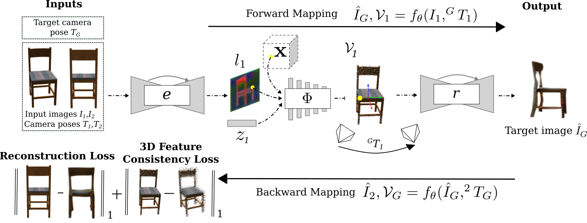

# Continuous Object Representation Networks: Novel View Synthesis without Target View Supervision
[[Paper]](https://arxiv.org/abs/2007.15627)


Official Pytorch implementation of Continuous Object Representation Networks: Novel View Synthesis without Target View Supervision

Continuous Object Representation Networks (CORNs) are a continuous, 3D geometry aware scene representation that can be learned from as little as two images per object. CORNs represent object geometry and appearance by conditionally extracting global and local features and using transformation chains and 3D feature consistency as self-supervision, requiring 50×fewer data during training than the current state-of-the-art models. By formulating the problem of novel view synthesis as a neural rendering algorithm, CORNs are end-to-end trainable from only two source views, without access to 3D data or 2D target views. This formulation naturally generalizes across scenes, and our auto-encoder-decoder framework avoids latent code optimization at test time, improving inference speed drastically.
Also check out the project [website](https://nicolaihaeni.github.io/corn/).

[](https://youtu.be/qqHI1QdswZc)

## Architecture
CORNs use a conditional feature encoder to extract global and local features from an input image. These features are combined with uniformally sampled 3D point coordinates and we learn a 3D feature representation that maps global features and local features to a 3D consistent feature space in world coordinates. As CORNs do not have access to the ground truth 2D target view, we construct a backward mapping trough our network to the second source images pose. During training, a CORN uses only two fixed source images per object, without 2D target view or 3D supervision. 




## Usage
### Installation
This code was tested with python 3.7.6, pytorch 1.3.1 and torchvision 0.4.2. I recommend creating a pip virtual enviroment for dependecy management. You can create and environment with name "corn" with all dependencies like so:

1. Create a virtual environment using python 3.7 in folder $HOME/virtualenvs/corn   
``` 
virtualenv -p /usr/bin/python3.7 $HOME/virtualenvs/corn
```   
2. Activate the virtual environment    
```
source $HOME/virtualenvs/corn/bin/activate 
```   
3. Install requirements    
``` 
pip install -r requirements.txt
```

### High-Level Structure
The code is organized as follows:

* test.py contains the testing code for source to target view transformation
* test_srn.py contains the testing code to generate a series of views from an input view
* train.py contains the training code
* data/ contains the data loader code
* models/ contains the corn model
* options/ contains the train/test options
* utils/ contains utility functions

### Pre-Trained Models
To be added shortly

### Data
To be added shortly

### Training
See `python train.py --help` for all train options. Example train call:
```
python train.py --name [experiment name] \
		--data_dir [path to directory containing train/val/test dataset]
		--checkpoints_dir [path to directory where outputs are saved]
```

To monitor progess, the training code writes tensorboard summaries, prints to the console and writes example images to disk. Example images can be visualized with the output html file in the browser found in checkpoints directory.

For experiments described in the paper, configuration files are available that configure the commandline options according to the settings in the paper. You only need to adapt the paths.

### Testing 
See `python test.py --help` for all train options. Example test call:
```
python test.py --name [experiment name] \
		--data_dir [path to directory containing train/val/test dataset]
		--checkpoints_dir [path to directory where outputs are saved]
```

Again, for experiments described in the paper, config files are available that configure the command line flags according to the settings in the paper. 

### Evaluation
See `python evaluation.py --help` for all evaluation options. Example evaluation call:
```
python evaluation.py  --src_dir [path to directory containing the test results]
```

Again, for experiments described in the paper, config files are available that configure the command line flags according to the settings in the paper. 


## Misc

### Citation
If you find our work useful in your research, please cite:
```
@inproceedings{hani2020corn,
	author = {H{\"a}ni, Nicolai 
	          and Engin, Selim
	          and Chao, Jun-Jee,
		  and Isler, Volkan},
	title = {Continuous Object Representation Networks:
             Novel View Synthesis without Target View Supervision},
	booktitle = {Advances in Neural Information Processing Systems (NeurIPS)},
	year={2020}
}
```

### Contact 
If you have any questions, please email Nicolai Häni at haeni001@umn.edu.
